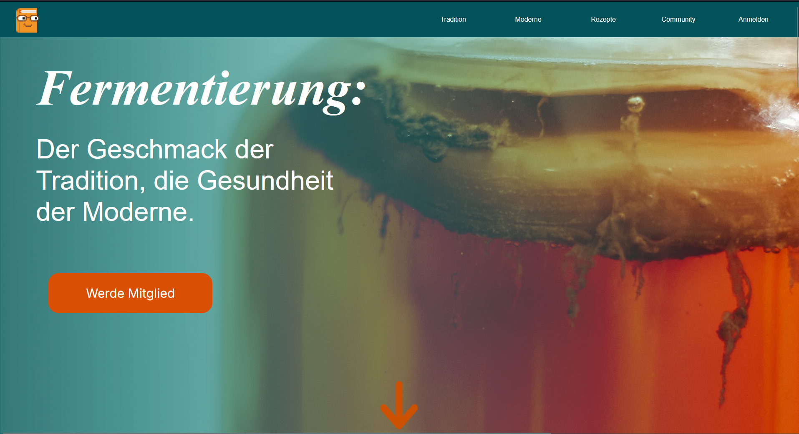
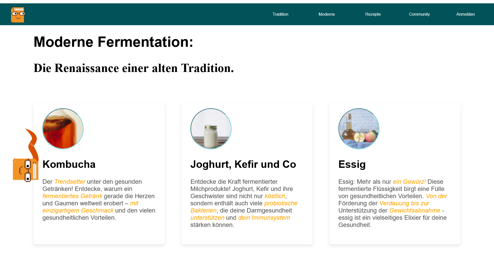
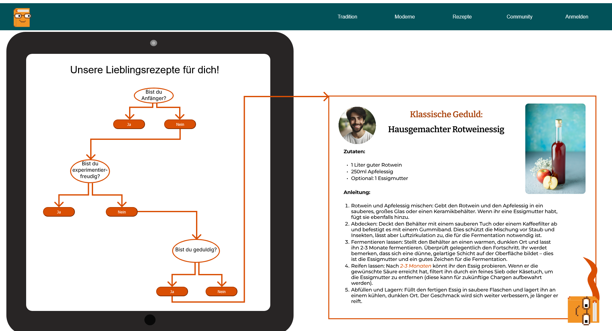
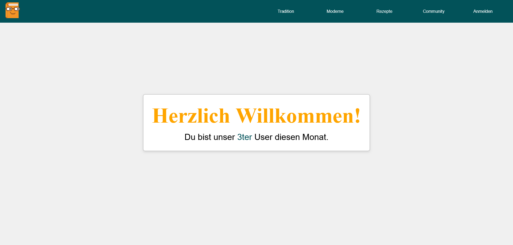

# Installation of Packages

To ensure proper use of our website, the following packages need to be installed:

- npm install rive-react
- npm install mysql2

# Website Resolution

Our website is designed for a resolution of 1920 x 1080.

# Database

We used XAMPP for the database. The `db.sql` script in the `sql_querys` folder will create a database with a table. This table is pre-filled with dummy data to simulate a realistic scenario.

# Impressions

# Group Members

- Rosalie Wieland
- Simon Knoblich
- Marco Holzäpfel
